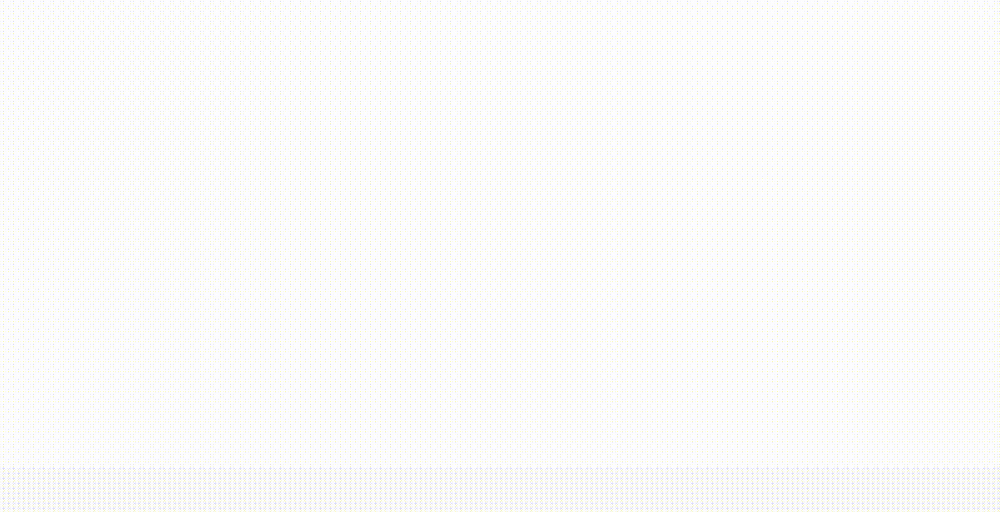

# 실행방법

```
git clone https://github.com/soozynn/triple-task.git

npm install
```

설치 후,

```
npm start
```

http://localhost:3000/ 을 실행시켜주세요.

# 최종 결과



# 사용한 기술과 선택한 이유

```
  "react": "^18.2.0",
  "react-dom": "^18.2.0",
  "react-router-dom": "^6.3.0",
  "styled-components": "^5.3.5",
```

- styled-components를 사용하게 된 이유
  props를 사용하여 style을 컴포넌트에 맞춰 유동적이게 적용할 수 있는 점을 좋아하기에 선택하게 되었습니다. 자체 스타일을 포함하기에 작은 컴포넌트를 잘 만들어 놓는다면 이외의 여러 프로젝트에서도 쉽게 재사용할 수 있는 이점과 이 외에도 글로벌 스타일을 주어 전체적으로 통일된 스타일 또한 적용할 수 있는 이점이 있어 해당 기술을 선택하게 되었습니다.

## Challenge

- 숫자가 올라가는 애니메이션 효과 직접 만들어보기
  과제를 받았을 때, 처음에는 과제의 요구사항 중에 하나인 애니메이션 구현 부분을 일반적으로 사용하는 keyframs를 이용하여 구현하려고 했으나 조금 더 도전적으로 만들어 볼 수 있는 부분이 어느 부분이 있을까에 대하여 고민하였습니다. 그러다 직접 커스텀 훅을 만들어서 효과를 만들어보는 것도 재밌겠다는 생각을 바탕으로 만들어보게 되었습니다. 이번 과제를 통해 조금 더 다방면으로 커스텀 훅을 만들어보고 여러 프로젝트에 적용해보고 싶다는 생각을 하게 되었습니다.

- 재사용성이 있는, 공용 컴포넌트 만들기
  과제 요구사항에서는 조금 벗어나지만, 개발자도구를 뜯어보면서 다른 섹션은 어떤 식으로 만들어져있는지에 대해 공부하는 시간을 가져보았습니다. 때문에 반복되어 사용되어지는 컴포넌트가 많다는 생각이 들어 컴포넌트를 만들 때에 최대한 작게 쪼개어 여러 곳에서도 재사용성있게 사용할 수 있도록 고민하면서 만들어보았습니다. 수정작업을 거치면서 컴포넌트를 작게 쪼개어 만들면 어떠한 이점이 있는지, 또 현재 내가 만들고 있는 방법이 좋은 방법인가에 대해서도 많이 생각해볼 수 있었던 시간이었습니다.

## About

과제 요구 사항의 코드는 components 폴더 내 Home 내부에 있는 AwardSection입니다. 감사합니다.
